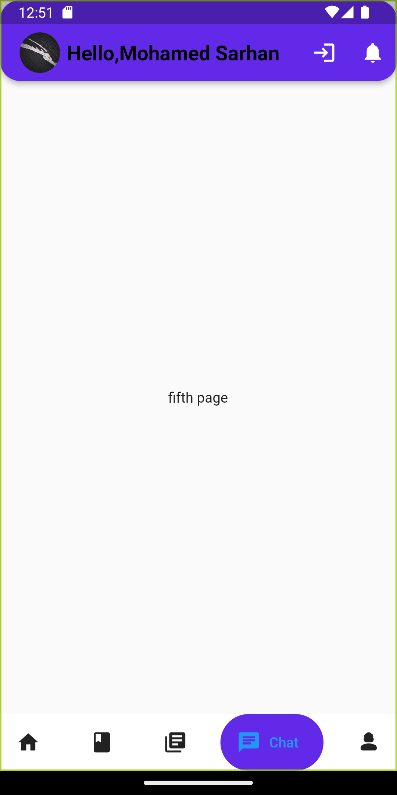

# chatbot

A new Flutter project.

update v4
update v3

## Getting Started

<h1> Login Page</h1>

 
<h1> Home Page </h1>
 

 
<h1> Books Page </h1>
 

 
<h1> Chat Page </h1>
 

 
<h1>Setting Page</h1>
 

